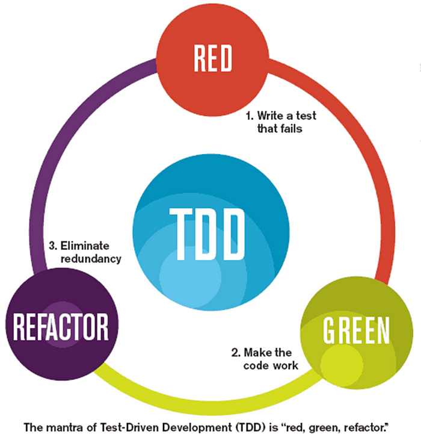

# Fundamentos de testing

## Introducción. ¿Qué es el testing?. Tipos de test

En programación, los **test automáticos** son una serie de pruebas que se realizan sobre un programa para verificar su correcto funcionamiento. Estas pruebas se realizan de forma **automática** y se pueden ejecutar en cualquier momento. Los test automáticos son una parte fundamental del desarrollo de software. Los tests nos permiten asegurarnos de que nuestro código funciona correctamente y de que no se rompe al realizar cambios. En este módulo aprenderemos los fundamentos de testing y cómo aplicarlos en el desarrollo de software.

Existen varios tipos de test, que tiene un objetivo diferente y son utilizados en distintos momentos y por diversos agentes a lo largo del ciclo de vida del software.

Entre los utilizados por los desarrolladores a lo largo del proceso de creación del software, se encuentran,
principalmente.

- los **test unitarios**
- los **test de aceptación**
- los **test de integración** (o de componentes)
- los **test end-to-end**

Más específicos de procesos posteriores podemos mencionar

- los **test de regresión**, que se aplican en las actualizaciones o las mejoras de una aplicación para determinar que los nuevos códigos funcionan correctamente.
- las **pruebas de carga**, que analizan el comportamiento del software según la variación de la carga de datos.
- las **pruebas de rendimiento**, que buscan revisar el comportamiento de la aplicación bajo un flujo determinado de usuarios y de información, normalmente de alto nivel.

Estos test son parte de la comprobación de la calidad y la eficacia del software y su realización no suele ser responsabilidad del desarrollador, sino de un equipo de calidad (QA) o de un equipo de operaciones.

Volviendo a los test más específicos de los desarrolladores, existe una representación del uso de cada uno de ellos conocida como **pirámide de test**. Esta pirámide nos indica que la base de la pirámide, los test unitarios, son los más numerosos y los que más se deben realizar, mientras que los test end-to-end, que son los más costosos y los que más tiempo consumen, son los menos numerosos.


Los **test de aceptación** serían un tipo de test de integración en el que se comprueba que el software cumple con los requisitos del cliente. Su uso estaría más orientado a la validación de la aplicación en el marco de la BDT que luego veremos.
Más en general, los **test de integración** son pruebas que se realizan sobre un conjunto de componentes de software para verificar que funcionan correctamente cuando se integran entre sí.
Los **test end-to-end** son pruebas que se realizan sobre un sistema completo para verificar que funciona correctamente desde el punto de vista del usuario.

Podemos verlo como un **continuo** que va desde la prueba de una unidad de código (test unitario) hasta la prueba de un sistema completo (test end-to-end).

## Test unitarios

En esta unidad nos centraremos en los test unitarios, que son pruebas que se realizan sobre unidades de código, como funciones o clases, de forma aislada. Los test unitarios nos permiten verificar que cada unidad de código funciona correctamente de forma independiente.

Los test unitarios deben ser **automáticos**, **repetibles** y **rápidos**. Los test unitarios deben ser automáticos para que se puedan ejecutar de forma automática sin intervención humana. Los test unitarios deben ser repetibles para que se puedan ejecutar de forma repetida y obtener siempre el mismo resultado. Los test unitarios deben ser rápidos para que se puedan ejecutar de forma rápida y obtener un feedback inmediato.

### Patrones de aplicación de test unitarios: (Cuando se aplican los test unitarios)

Existen varios enfoques para aplicar test unitarios en el desarrollo de software. Algunos de los enfoques o técnicas de testing más comunes son:

- **Test unitarios a posteriori**: En este enfoque, primero se implementa el código y luego se escriben los test unitarios para verificar que el código funciona correctamente. Este enfoque es teóricamente el menos correcto, pero es muy común en la práctica, especialmente en proyectos heredados o en proyectos en los que no se ha aplicado TDD o BDD.
- **Test Driven Development (TDD)** / **Test Driven Design (TDD)**: En este enfoque, primero se escriben los test unitarios y luego se implementa el código que hace que los test pasen. Este enfoque nos permite asegurarnos de que el código que escribimos cumple con los requisitos que hemos definido en los test. En este contexto es muy importante el concepto de refactorización, conocido a veces como `red-green-refactor`.
- **Behavior Driven Development (BDD)**: En este enfoque, primero se definen los comportamientos que queremos que tenga nuestro código y luego se escriben los test unitarios que verifican esos comportamientos. Este enfoque nos permite centrarnos en el comportamiento de nuestro código y no en la implementación concreta.

### TDD y BDD

El TDD se basa en el ciclo de desarrollo **red-green-refactor**. En el ciclo **red-green-refactor** primero se escribe un test unitario que falla (red), luego se implementa el código que hace que el test pase (green) y finalmente se refactoriza el código para mejorar su calidad (refactor). Este ciclo se repite de forma iterativa y evolutiva a lo largo del desarrollo del software.



El **BDD** es una evolución del TDD que se centra en el comportamiento del software en lugar de en la implementación concreta. En BDD se definen los comportamientos que queremos que tenga nuestro software (criterios de aceptación) y sus correspondientes tests. En un segundo nivel se añaden los test unitarios específicos que verifican esos comportamientos. Finalmente se implementa el código que hace que los test pasen.
En BDD se utilizan palabras clave como `Given`, `When` y `Then` para definir los escenarios de test dando lugar a una sintaxis más natural y legible. Este modelo de creación de los test se conoce también como **Given-When-Then** y como **gherkin**, por su vinculación con el entorno de testing [Cucumber](https://cucumber.io/).

En TDD y BDD, la teoría es que los test unitarios se utilizan como una **herramienta de diseño del código**. Al definir a priori los requisitos que debe cumplir nuestro código, ayudan a implementar esos requisitos de forma incremental y evolutiva, siguiendo determinados patrones de diseño derivados de la propia definición de los test. En realidad el diseño no es siempre tan evidente y muchas veces surge también de criterios independientes de los propios tests.

En todos los casos, los test unitarios se utilizan como una **herramienta de documentación** del código. Los test unitarios nos permiten definir y documentar los requisitos que debe cumplir nuestro código y nos ayudan a mantener esos requisitos a lo largo del tiempo.

### Herramientas de testing unitario en JavaScript

Existen muchas herramientas de testing que nos permiten escribir y ejecutar test unitarios de forma sencilla. En el caso concreto de JavaScript, algunas de las framework de testing más populares son:

- [**Mocha** / **Chai**](https://mochajs.org/): es probablemente el primero de los frameworks de testing de JavaScript. Mocha es un framework de testing y Chai es una librería de aserciones que nos permite verificar que los resultados de los test son los esperados. En gran parte es la base de los siguientes, que en todos los casos incorporan la librería de aserciones en lugar de usar una externa.
- [**Jasmine**](https://jasmine.github.io/): Viene incluido en Angular, utilizando como motor de test (test runner) Karma.
- [**Jest**](https://jestjs.io/es-ES/): Es una herramienta de testing desarrollada por Facebook y utilizada en proyectos de React.
- [**Vitest**](https://vitest.dev/): Es una herramienta de testing desarrollada por Vite.

Especialmente cuando se trata del backend existe también la posibilidad de utilizar el modulo de testing **node:assert** incluido de forma nativa en Node.js a partir de la versión 18, que proporciona el objeto `assert` con una serie de métodos para realizar aserciones.

### Elementos básicos de los test unitarios

- **Test suite**: Es un conjunto de test unitarios que se agrupan en una estructura jerárquica. En una test suite se pueden agrupar los test unitarios por funcionalidad, por módulo o por cualquier otro criterio que se considere adecuado. Para definir una test suite se utiliza la función `describe`.

- **Test unitario**: Es una prueba que se realiza sobre una unidad de código, como una función o una clase, de forma aislada. Un test unitario debe ser independiente de otros test y no debe depender de la ejecución de otros test. Para definir un test unitario se utiliza la función `it` o `test`.

- **Aserción**: Es una expresión que se evalúa para verificar que el resultado de un test es el esperado. En JavaScript, las aserciones se realizan utilizando la función `expect` de la librería de aserciones que estemos utilizando. Para comprobar la validez de una aserción, se utilizan una seria de funciones booleanas que se encargan de comparar el valor esperado con el valor obtenido. Una de las funciones más comunes para realizar aserciones es la función `toBe`.

- **Setup y teardown**: Son funciones que se ejecutan antes y después de cada test unitario. En estas funciones se pueden realizar tareas de inicialización y limpieza que sean necesarias para la ejecución del test. Se definen utilizando las funciones `beforeEach`, `afterEach`, `beforeAll` y `afterAll`. Estas funciones se conocen como **hooks** porque se ejecutan automáticamente en momentos concretos del ciclo de vida de un test.

Tenemos en un modulo ES una sencilla función que suma dos números:

```js
// add.js
export function add(a, b) {
  return a + b;
}
```

Veamos un ejemplo de test unitario utilizando Jest:

```js
// test.js
import { add } from './add.js';
describe('function add(1,2) ', () => {
  it('should return 3, the sum both numbers', () => {
    expect(add(1, 2)).toBe(3);
  });
});
```

Ese mismo test en Node sería:

```js
// test.js
import assert from 'assert';
import test, { it, describe } from 'node:test';
import { add } from './add.js';

import { add } from './sample.js';

describe('function add(1,2)', () => {
  test('return 3, the sum both numbers', () => {
    assert.equal(add(1, 2), 3);
  });
});
```

En Jest los elementos de la librería son globales, por lo que no es necesario importarlos.
En Node, en cambio, es necesario importarlos desde diversos módulos y de forma anónima o con nombre, según los casos.

La llamada al runner de los test unitarios es diferente en los dos casos

- en Jest el comando npm sera `jest`
- y en Node `node --test`

En cualquiera de los casos se ejecutarán todos los test unitarios del proyecto y se mostrará el resultado en la consola.

### Patrones de organización del código en los test unitarios

Existen varios patrones de organización del código incluido en los test unitarios que nos permiten estructurar los test de forma clara y coherente. Algunos de los más comunes entre estos patrones comunes son:

- **Gherkin o Given-When-Then**. Patrón ya mencionado en BDD, puede también utilizarse en la organización de los test unitarios. En este patrón se dividen los test unitarios en tres partes: Given, When y Then. En la parte Given se definen las condiciones iniciales del test, en la parte When se ejecuta el código que se quiere probar y en la parte Then se verifican los resultados obtenidos. En algunos casos las dos primeras partes corresponden a las funciones describe, incluyendo si es necesario los hooks, y la tercera a la función it. Este patrón nos permite estructurar los test de forma clara y coherente y nos ayuda a identificar los problemas de forma rápida y sencilla.

- **AAA (Arrange-Act-Assert)**: En este patrón se dividen los test unitarios en tres partes: Arrange, Act y Assert. En la parte Arrange se definen las condiciones iniciales del test, en la parte Act se ejecuta el código que se quiere probar y en la parte Assert se verifican los resultados obtenidos. Este patrón es similar al patrón Given-When-Then pero se centra más en la estructura de la función test.

Las suites creadas con los describe pueden agrupar los test unitarios por funcionalidad, por módulo, por escenario o por cualquier otro criterio que se considere adecuado. Para definir una test suite se utiliza la función `describe`. En todos los casos cada test unitario se corresponde con un caso de uso concreto dentro del criterio elegido (funcionalidad, módulo, escenario, tipo...).

### Coverage (Cobertura de código) y diseño de casos de prueba

El coverage o cobertura de código es una métrica que nos indica el porcentaje de código que está cubierto por los test. El objetivo del coverage es asegurarnos de que todos los caminos de ejecución de nuestro código están cubiertos por los test, es decir que han sido ejecutadas todas las líneas de código y todas las ramas de decisión.

El coverage se mide en porcentaje y se calcula dividiendo el número de líneas de código que han sido ejecutadas por los test entre el número total de líneas de código del programa. Un coverage del 100% significa que todas las líneas de código han sido ejecutadas por los test.

El coverage es una métrica muy útil para evaluar la calidad de los test y para identificar las partes del código que no están cubiertas por los test. Sin embargo, aunque puede entenderse como condición necesaria, un coverage del 100% no es suficiente para garantizar la calidad del software porque puede haber casos de uso que no se hayan contemplado.

### Stubs: Mocks y Spies

En el desarrollo de test unitarios es muy común que necesitemos simular el comportamiento de ciertas partes del código para poder probar otras partes del código. Para ello, utilizamos los **stubs**, que son objetos que simulan el comportamiento de otros objetos. Los stubs se utilizan para simular el comportamiento de objetos que no están disponibles en el entorno de test o que no se pueden utilizar en el entorno de test.

Existen varios tipos de stubs, entre los que se encuentran los **mocks** y los **spies**. Los mocks son objetos que simulan el comportamiento de otros objetos y permiten verificar que se han llamado los métodos correctos con los argumentos correctos. Los spies son objetos que permiten verificar que se han llamado los métodos correctos con los argumentos correctos.

Esta distinción no es siempre clara y depende mucho del framework de testing. Por ejemplo, en Jest, los mocks y los spies son conceptos diferentes tal como se ha explicado, pero los spies pueden convertirse en mocks si se les añade la capacidad de simular el comportamiento de un objeto. En Mocha, los mocks y los spies son conceptos diferentes y se utilizan de forma independiente. En Jasmine, los mocks y los spies son conceptos similares y se utilizan indistintamente.

## Referencias

VIDEO: [¿Qué es el Testing de Aplicaciones?](https://www.youtube.com/watch?v=JYTFWzevtlQ&list=PLo5lAe9kQrwqp3DqR2Ah-0MlSjRBBlqaA&index=3) por Fazt Code

- [An Overview of JavaScript Testing in 2022](https://medium.com/welldone-software/an-overview-of-javascript-testing-7ce7298b9870) by Vitali Zaidman (2022)
- [The Testing Trophy and Testing Classifications](https://kentcdodds.com/blog/the-testing-trophy-and-testing-classifications) by Kent C. Dodds (2021)
- [JavaScript Testing: Unit vs Functional vs Integration Tests](https://www.sitepoint.com/javascript-testing-unit-functional-integration/) by Eric Elliott (2016)
